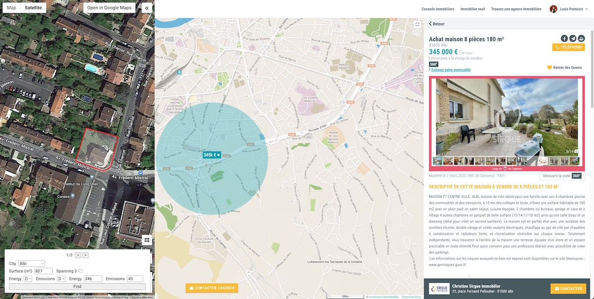
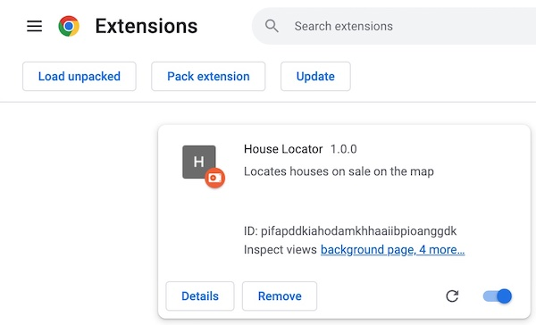

# HouseLocator

[](docs/intro.jpg)

### Pourquoi cette extension Chrome ?

Les annonces immobilières en France ne contiennent pas l’adresse des biens. C’est une situation deplorable. L’adresse est l’information la plus importante pour considerer un bien.

### Que fait cette extension Chrome ?

Cette extension Chrome permet d’aider à localiser des biens d’annonces immobilières.

L’extension utilise la taille du terrain (i.e. de la parcelle), ainsi que les résultats du diagnostic technique DPE. Elle peut ainsi entourer les parcelles de cette taille sur la carte, et placer des marqueurs sur DPEs identiques.

Grace aux annotations, l’utilisateur peut trouver ou se situe le bien de l’annonce.

### Comment utiliser ce projet ?

Ce projet est partagé dans un état un peu brouillon. Je le partage pour aider des gens qui rencontrent le problème que j’ai rencontre. Par contre, je n’ai pas pris le temps de rendre l’application facile à utiliser pour des utilisateurs non-informaticiens.

#### Téléchargement des données de reference

L’extension a besoin des données de parcelles et des DPEs, pour les villes considérées. Le dossier `preprocessor` contient un projet NodeJS qui s’occupe de télécharger ces fichiers auprès des sites officiels du gouvernement français.

Editez le fichier `preprocessor/node-preprocessor.ts` pour choisir les villes qui vous intéresse, puis lancez cette commande :

```sh
~/git/house-locator/preprocessor
$ node --require ts-node/register prenode-preprocessor.ts
```

#### Changement de la clé Google Maps API

L’extension affiche une carte Google Maps, et a donc besoin d’une clé. Vous pouvez la changer en haut du fichier `browser/main.ts`.

#### Installation de l’extension Chrome

L’extension peut être installée localement en allant a l’URL `chrome://extensions/` dans Chrome, puis en cliquant sur `Load unpacked`, et en sélectionnant le dossier `browser`.

[](docs/add_extension.jpg)

#### Utilisation de l’extension Chrome

Sur la page d’une annonce immobilière, cliquez sur l’icône de l’extension Chrome dans la barre d’outils Chrome. Un panneau va apparaitre sur la gauche de la page web, et va montrer une carte. Sur leboncoin.fr ou bienici.com, les informations de surface et DPE seront pré-remplies.

Vous pouvez utiliser les outils en bas de la carte pour explorer et essayer de localiser le bien.
